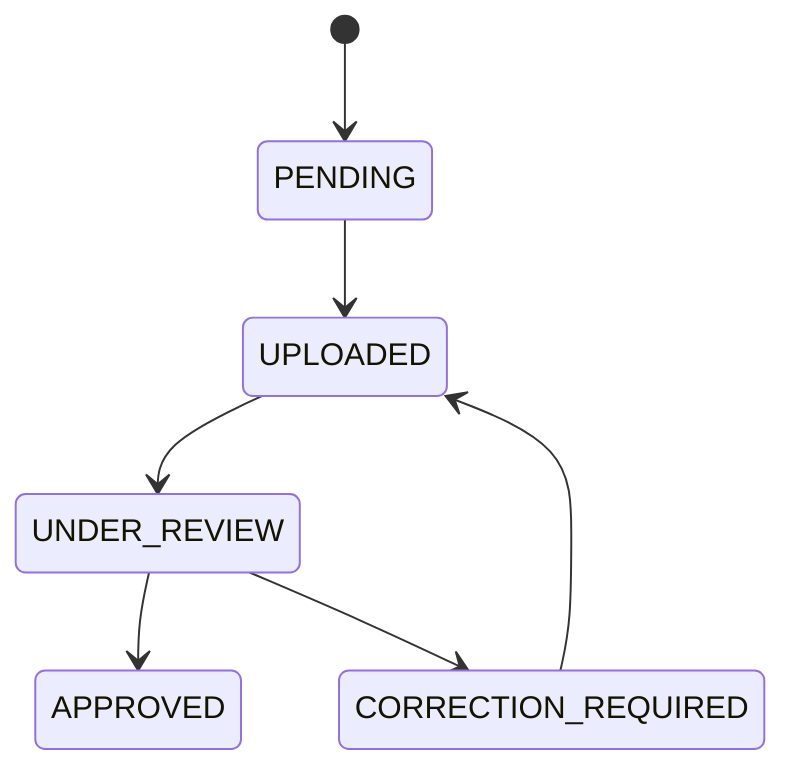

# AuditFlow

> **"Audit document review, without the scattered workflow."**

AuditFlow is a lightweight, multi-tenant audit document review platform designed for small and mid-sized Chartered Accountant (CA) firms.

It centralizes:
- Client audit document requirements
- Document uploads
- Document versions
- Reviewer workflows
- Correction requests
- Approvals
- Audit history
- Firm-level data isolation

```
┌──────────────────────────────────────────────────────────────────────────┐
│  Status: Production-Ready MVP  •  Tenancy: Multi-Tenant Firm Isolation   │
│  Workflow: Document Review     •  Audit: Append-Only Audit Trail         │
│  Security: Role-Based Access   •  Tests: 38 Automated Tests Passing      │
└──────────────────────────────────────────────────────────────────────────┘
```

**Live Deployment:**
- **Web App**: [https://audit-flow-topaz.vercel.app](https://audit-flow-topaz.vercel.app/)
- **API Server**: [https://auditflow-api-etbb.onrender.com](https://auditflow-api-etbb.onrender.com/)

**Demo:**
- **Video Link** : [https://drive.google.com/file/d/1kzk8KfbFA0NZV41eK7l3vvgU3LkvmRN-/view?usp=drive_link](https://drive.google.com/file/d/1kzk8KfbFA0NZV41eK7l3vvgU3LkvmRN-/view?usp=drive_link)

---

## 1. Problem

Statutory audit workflows in small and mid-sized CA firms involve gathering, reviewing, and verifying hundreds of client documents every financial year—including bank statements, sales and purchase registers, GST returns, depreciation schedules, and tax deduction certificates.

Today, this workflow is routinely handled across disconnected tools:
- **WhatsApp** for ad-hoc file exchanges
- **Excel sheets** for tracking checklists
- **Email threads** for requesting missing files
- **Google Drive / Dropbox folders** for file storage
- **Manual phone follow-ups** to chase corrections

This creates severe operational problems:
- **Unclear Document Status**: Teams cannot easily tell which documents are uploaded, which are under active review, and which are pending.
- **Duplicate and Revised Documents**: When clients send revisions with vague filenames (`GSTR_final_v2_edit.pdf`), staff often compute numbers against outdated spreadsheets.
- **Missed Corrections**: Reviewer feedback given verbally or via chat gets buried, leading to repeated errors and lost context.
- **Unclear Ownership**: Firm partners cannot quickly determine who uploaded a file, which reviewer is working on it, or where an engagement is stalled.
- **Difficulty Knowing Who Reviewed What**: When questions arise later, there is no single source of truth detailing who examined each document and when.
- **Poor Traceability**: During internal quality reviews, peer reviews, or regulatory inquiries, the firm struggles to defend its audit trail.

AuditFlow centralizes this entire review workflow into one structured system.

---

## 2. Solution

AuditFlow provides an intentional, workflow-focused platform for CA audit teams.

The core workflow is simple and disciplined:

```
Client
  │
  ▼
Document Requirements
  │
  ▼
Upload
  │
  ▼
Review
  │
  ├──► Approve ───► Certified Document
  │                     │
  ▼                     ▼
Request Correction  Immutable Audit History
  │
  ▼
Re-upload (New Version)
  │
  ▼
Review & Approve
```

Rather than attempting to become an all-in-one practice management ERP, tax filing engine, or billing suite, AuditFlow is intentionally focused on solving **one critical workflow**: collecting, reviewing, correcting, and verifying audit documents with full traceability.

This product focus eliminates clutter, reduces training overhead for staff, and ensures the core review pipeline remains fast, secure, and auditable.

---

## 3. Core Features

### Multi-Tenant Firms
Multiple independent CA firms can use the same deployed system while their data remains completely isolated. All queries for clients, requirements, documents, versions, and audit logs are scoped by the authenticated user's `firmId`. Users from one firm cannot view, access, or alter another firm's data.

### Role-Based Access
AuditFlow defines two distinct roles within a CA firm:
- **Staff**:
  - View clients belonging to their firm
  - Inspect client document checklists and requirement statuses
  - Upload initial documents for pending requirements
  - Respond to correction requests by uploading revised versions
  - View document review statuses, feedback notes, and version histories
- **Reviewer**:
  - View all clients and documents across the firm
  - Manage client document requirements (add, edit, and deactivate checklists)
  - Access the firm Review Queue to claim and inspect pending documents
  - Start reviews on uploaded documents
  - Request corrections with mandatory explanatory audit notes
  - Approve and certify audited documents
  - Inspect the firm-wide compliance audit activity feed

### Client Management
Firms can manage multiple client engagements (e.g., private limited companies, LLPs, proprietorships). Each client record maintains essential audit metadata—including company name, industry, financial year (e.g., `2025-26`), GSTIN, and PAN—alongside live document completion meters.

### Configurable Document Requirements
Document requirements in AuditFlow are **not hard-coded**. Different clients require different audit documentation depending on their industry, entity structure, and statutory scope:
- **Add Requirements**: Reviewers can add custom requirements specific to any client (e.g., *Inventory Report* for a factory, *TDS Certificate* for a consultancy).
- **Edit Requirements**: Reviewers can rename requirements or update filing instructions.
- **Deactivate Requirements**: Reviewers can deactivate requirements that are no longer applicable. Deactivation (`isActive: false`) is strictly preferred over destructive deletion so that historical document submissions, version records, and audit events remain preserved for future compliance defense.
- **Staff Restrictions**: Staff can view requirements and upload files against them, but cannot add, rename, or deactivate requirements.

### Document Upload
AuditFlow supports real document uploads processed through the configured storage layer:
- **Permitted File Formats**: PDF (`.pdf`), Excel (`.xls`, `.xlsx`), CSV (`.csv`), and image formats (`.jpg`, `.jpeg`, `.png`, `.webp`).
- **File Size Limit**: Up to 10 MB per file.
- **Storage Infrastructure**: Backed by Multer memory buffers integrated with Cloudinary for production cloud storage, with an automatic Base64 Data URI fallback for self-contained testing and offline evaluation.

### Document Versioning
Re-uploading a corrected document creates a new version rather than overwriting the previous file:
- An initial upload creates **Version 1**.
- If a reviewer flags an issue and requests a correction, staff re-uploading the file creates **Version 2**.
- Both Version 1 and Version 2 remain permanently accessible, recording individual upload timestamps, uploader attribution, review notes, and file links.

### Review Workflow
Documents advance through an explicit state machine:
- `PENDING` $\rightarrow$ Requirement created, awaiting initial upload.
- `UPLOADED` $\rightarrow$ File uploaded by staff, ready for review.
- `UNDER_REVIEW` $\rightarrow$ Reviewer has claimed the document and opened review.
- `CORRECTION_REQUIRED` $\rightarrow$ Reviewer flagged an issue with a mandatory audit note; awaiting staff re-upload.
- `APPROVED` $\rightarrow$ Document certified by reviewer (terminal approved state).

### Review Queue
Reviewers have a dedicated triage workspace for documents requiring attention:
- **Awaiting Review**: Unreviewed uploads and revisions, sorted in **First-In, First-Out (FIFO)** order by oldest upload date to maintain turnaround times. Each card shows an active waiting timer (e.g., *"Waiting 1h 45m"*).
- **Needs Correction**: Documents returned to staff with outstanding correction notes.
- **Recently Approved**: Feed of the 10 most recently approved documents for quick reference.

### Audit Trail
Every meaningful business action generates a permanent audit event logged by backend services:
- Document uploaded or re-uploaded
- Review started
- Correction requested with feedback
- Document approved
- Requirement created, updated, deactivated, or reactivated
- Client registered
- User logged in

Audit events are strictly append-only; standard application users have no ability to edit or remove logged events.

### Audit Timeline
Each document includes a visual timeline displaying:
- **Who**: Actor name, email address, and role (`STAFF` or `REVIEWER`).
- **What**: Action type (e.g., `CORRECTION_REQUESTED`, `DOCUMENT_APPROVED`).
- **When**: Server-derived ISO timestamp with relative formatting.
- **Document / Version**: The specific document version affected.
- **Comment / Reason**: Explanatory notes provided during review.

### Search and Filtering
AuditFlow includes focused, real-time search and filter tools:
- **Client Search**: Filter client engagements instantly by company name or industry.
- **Review Queue Tabs**: Segment queue items between *Awaiting Review*, *Needs Correction*, and *Recently Approved*.
- **Requirement Status Tabbing**: Toggle between active checklist items and deactivated archives.
- **Activity Log Filters**: Filter the firm audit ledger by specific actions (`UPLOAD`, `REVIEW`, `CORRECTION`, `APPROVE`, `REQUIREMENT`).

### Responsive UI
The interface supports desktop, tablet, and mobile viewports:
- Desktop-first layout with high-density data tables and split-screen review desks.
- Horizontal scroll preservation for complex audit tables on smaller viewports.
- Responsive floating mobile navigation drawer with role switcher and firm indicators.

### Premium UI
The user interface is built on **Apple-inspired visual principles with an original AuditFlow design system**:
- **Floating Liquid-Glass Navigation**: Centered, pill-shaped top navigation bar with subtle backdrop blur, hairline borders, and responsive scroll dynamics.
- **Restrained Color Palette**: Crisp white surfaces on an off-white canvas (`#f8fafc`), with soft indicator dots and muted pill badges instead of loud saturated gradients.
- **Refined Typography**: Native system font stack (`-apple-system`, `SF Pro Text`, `Segoe UI`) with optical kerning and subtle micro-shadows.

---

## 4. Product Workflow

The following example illustrates how a typical audit document moves through AuditFlow:

```
Firm: ABC & Co. (Chartered Accountants)
│
├── Client: ABC Traders Pvt. Ltd. (FY 2025-26)
│   └── Requirement: GST Return
│
├── 1. Initial Upload
│      Rohit Sharma (Staff) uploads "GSTR_3B_Q3.pdf"
│      • Document status: PENDING ➔ UPLOADED
│      • Version 1 created
│      • Audit event logged: DOCUMENT_UPLOADED (Actor: Rohit, Version 1)
│
├── 2. Review Started
│      Aman Verma (Reviewer) opens the file from the Review Queue
│      • Document status: UPLOADED ➔ UNDER_REVIEW
│      • Audit event logged: REVIEW_STARTED (Actor: Aman)
│
├── 3. Correction Requested
│      Aman notes an Input Tax Credit mismatch:
│      • Comment: "Table 4(A) ITC does not match 2B summary by ₹18,400"
│      • Document status: UNDER_REVIEW ➔ CORRECTION_REQUIRED
│      • Audit event logged: CORRECTION_REQUESTED (Actor: Aman, Comment attached)
│
├── 4. Revision Uploaded
│      Rohit reads the reviewer's note and uploads the reconciled filing:
│      • Uploads "GSTR_3B_Q3_Reconciled.pdf"
│      • Document status: CORRECTION_REQUIRED ➔ UPLOADED
│      • Version 2 created (Version 1 remains preserved)
│      • Audit event logged: DOCUMENT_REUPLOADED (Actor: Rohit, Version 2)
│
├── 5. Verification & Approval
│      Aman inspects Version 2 and approves the submission:
│      • Comment: "Reconciled with 2B. Certified."
│      • Document status: UNDER_REVIEW ➔ APPROVED
│      • Audit event logged: DOCUMENT_APPROVED (Actor: Aman)
│
└── 6. Traceability Complete
       The audit timeline preserves every event, timestamp, file version,
       and comment for regulatory and peer-review defense.
```

---

## 5. Roles & Responsibilities

Staff and Reviewers are both authenticated users belonging to the same CA firm. The client engagement belongs to the firm entity, not to any individual user.

```
                   CA Firm: ABC & Co.
                           │
         ┌─────────────────┴─────────────────┐
         ▼                                   ▼
  Aman — Reviewer                     Rohit — Staff
         │                                   │
         │ Reviews, Approves, Manages Checklists
         │                                   │ Uploads Files & Corrects Revisions
         └─────────────────┬─────────────────┘
                           ▼
             Client: ABC Traders Pvt. Ltd.
```

| Role | Capabilities |
|---|---|
| **Staff** | View assigned firm clients, inspect document checklists, upload initial document files (`PENDING`), respond to correction requests by uploading revisions (`CORRECTION_REQUIRED`), view review statuses and notes. |
| **Reviewer** | Manage document requirements (add, edit, deactivate), access the Review Queue (FIFO backlog), claim documents (`UNDER_REVIEW`), request corrections with mandatory notes, approve and certify documents (`APPROVED`), view firm-wide compliance audit logs. |

---

## 6. Multi-Tenant Security

AuditFlow is designed around **firm-level tenancy**. Every tenant-owned resource in the system is associated with a specific firm.

Conceptually:

```
User ──► firmId ──► Client ──► Documents ──► Versions ──► Audit Events
```

### Application-Level Tenant Isolation
Backend authorization ensures that users can only interact with resources belonging to their own firm:

- **Authentication ("Who are you?")**: The user presents their credentials, verified via bcrypt against the database. The server issues a signed JWT containing `userId`, `firmId`, and `role`.
- **Authorization ("Are you allowed to access this resource?")**: 
  - On every request, the backend extracts `req.user.firmId` from the verified token.
  - Every database query for tenant-scoped collections (`Client`, `DocumentRequirement`, `Document`, `DocumentVersion`, `AuditEvent`) injects `firmId: req.user.firmId`.
  - Frontend button hiding is purely for user ergonomics; **frontend visibility is never treated as a security boundary**.

### Cross-Tenant Defense Example
Consider two separate CA firms operating on the same platform:

```
Firm A: ABC & Co.
└── ABC Traders Pvt. Ltd. (ID: client_abc)

Firm B: XYZ & Co.
└── XYZ Manufacturing Pvt. Ltd. (ID: client_xyz)
```

If an authenticated user from **Firm A** attempts to query **Firm B's** client via `GET /api/clients/client_xyz`:
1. The backend executes `Client.findOne({ _id: "client_xyz", firmId: "firm_a" })`.
2. Because `client_xyz` belongs to `firm_b`, the database query returns `null`.
3. The server responds with **HTTP 404 Not Found**.

This ensures Firm A users cannot view, modify, or even confirm the existence of another firm's clients, files, or audit logs.

*(Note: This represents application-level tenant isolation appropriate for the MVP).*

---

## 7. Architecture

AuditFlow uses a straightforward, modular architecture designed for operational simplicity and ease of evaluation:

```
                 React + Vite SPA Client
                 (TanStack Query, Tailwind)
                            │
                            │ REST API (Bearer JWT)
                            ▼
                   Node.js + Express
                            │
      ├─────────────────────┼─────────────────────┤
      ▼                     ▼                     ▼
Authentication &     Business Services &    Audit Service
RBAC Middleware      Workflow Machine       (Append-Only)
      │                     │                     │
      └─────────────────────┼─────────────────────┘
                            │
                            ▼
                    MongoDB Database
                (Mongoose ODM Schemas)
                            │
                            ▼ (File Uploads)
              Cloudinary / Local Data URI
```

### Layer Responsibilities
- **Frontend SPA (`client/`)**: Single-page application built with React, Vite, and TanStack Query. Handles client-side state caching, optimistic UI updates, floating glass navigation, and role-based interface views.
- **REST API (`server/src/routes/`, `server/src/controllers/`)**: Validates input payloads using Zod schemas, extracts user tokens, and maps requests to business services.
- **Authentication & Authorization Middleware (`server/src/middleware/`)**: Verifies JWT signatures, enforces role requirements (`requireRole(['REVIEWER'])`), and restricts uploads by MIME type and size.
- **Business Services (`server/src/services/`)**: Enforces tenant-scoped database queries, runs state machine transition checks, calculates FIFO review wait durations, and invokes the audit service.
- **Database & Storage (`server/src/models/`, `server/src/config/`)**: MongoDB database using Mongoose schemas with compound indexes. File storage is managed via Multer memory buffers with Cloudinary upload streaming or local Base64 Data URI fallbacks.

The architecture is intentionally simple, self-contained, and free of unnecessary microservice complexity for the MVP.

---

## 8. Data Model

AuditFlow's data model reflects firm-level multi-tenancy and audit document hierarchy:

```
Firm
 │
 ├── Users (Staff / Reviewers)
 │
 └── Clients
      │
      └── Document Requirements
             │
             └── Documents
                   │
                   ├── Versions (v1, v2...)
                   │
                   └── Audit Events (Timeline)
```

### Models & Purposes
- **Firm**: Represents an accounting firm tenant (`name`, unique uppercase `code`).
- **User**: A professional within a firm (`name`, `email`, hashed `password`, `role`: `STAFF` | `REVIEWER`, `firmId`).
- **Client**: A company or entity being audited (`name`, `industry`, `financialYear`, `gstin`, `pan`, `firmId`).
- **DocumentRequirement**: A client-specific checklist requirement (`name`, `description`, `category`, `isActive`, `clientId`, `firmId`).
- **Document**: The primary audit document record tracking workflow state (`title`, `category`, `status`, `currentVersionNumber`, `requirementId`, `latestCorrectionComment`, `reviewedBy`, `firmId`).
- **DocumentVersion**: An uploaded physical file revision (`versionNumber`, `fileName`, `fileSize`, `fileType`, `fileUrl`, `uploadedBy`, `reviewStatus`, `reviewComment`, `documentId`, `firmId`).
- **AuditEvent**: An immutable audit ledger event (`actorId`, `action`, `comment`, `metadata`, `createdAt`, `clientId`, `documentId`, `firmId`).

---

## 9. Audit Design

Auditability is central to AuditFlow's design. The system implements an **application-level append-only audit trail**:

- **Backend-Generated Events**: Audit records can only be generated as side effects of successful business service actions. The API exposes no endpoint for clients to arbitrarily create audit logs.
- **Fixed Attribution**: The client application cannot set or tamper with timestamps, actor IDs, firm IDs, or action types. These values are derived on the server from the verified JWT session and server clock.
- **No Edit or Delete Capability**: Normal users, including Reviewers and Staff, cannot edit or delete audit events. The REST API exposes **no `PUT`, `PATCH`, or `DELETE` routes** for audit data, and the Mongoose schema disables `updatedAt` (`timestamps: { createdAt: true, updatedAt: false }`).
- **Standardized Action Enums**:
  - `DOCUMENT_UPLOADED`
  - `REVIEW_STARTED`
  - `CORRECTION_REQUESTED`
  - `DOCUMENT_REUPLOADED`
  - `DOCUMENT_APPROVED`
  - `REQUIREMENT_CREATED` / `REQUIREMENT_UPDATED` / `REQUIREMENT_DEACTIVATED` / `REQUIREMENT_REACTIVATED`
  - `CLIENT_CREATED`
  - `USER_LOGIN`
- **Reconstructibility**: Because document versions and audit events are retained indefinitely, firm reviewers, partners, and peer reviewers can reliably reconstruct the complete sequence of events for any audit document.

---

## 10. Document Lifecycle

Documents follow a strict state transition matrix enforced by `documentService.ts`:



### State Definitions & Permitted Transitions
| Current Status | Allowed Next Status | Description | Role Required |
|---|---|---|:---:|
| `PENDING` | `UPLOADED` | Initial file uploaded by staff | `STAFF` |
| `UPLOADED` | `UNDER_REVIEW` | Reviewer claims document to begin verification | `REVIEWER` |
| `UNDER_REVIEW` | `CORRECTION_REQUIRED` | Reviewer requests correction with explanatory note | `REVIEWER` |
| `CORRECTION_REQUIRED` | `UPLOADED` | Staff uploads revised file addressing feedback | `STAFF` |
| `UNDER_REVIEW` | `APPROVED` | Reviewer certifies document as complete | `REVIEWER` |
| `APPROVED` | *(None)* | Terminal approved audit state | N/A |

*Attempts to execute invalid transitions (e.g., jumping from `PENDING` directly to `APPROVED`, or modifying an `APPROVED` document) are rejected with HTTP `400 Bad Request`.*

---

## 11. Seeded Demo Accounts & Evaluation Guide

AuditFlow comes pre-seeded with accounts for two independent CA firms:

| Firm | Role | Name | Email | Password |
|---|---|---|---|---|
| **Firm A (ABC & Co.)** | Staff | Rohit Sharma | `rohit@auditflow.demo` | `AuditFlow@123` |
| **Firm A (ABC & Co.)** | Reviewer | Aman Verma | `aman@auditflow.demo` | `AuditFlow@123` |
| **Firm B (XYZ & Co.)** | Staff | Raj Patel | `raj@auditflow.demo` | `AuditFlow@123` |
| **Firm B (XYZ & Co.)** | Reviewer | Priya Nair | `priya@auditflow.demo` | `AuditFlow@123` |

*Both the login screen and the floating top bar profile popover include 1-click demo role switchers for rapid evaluation.*

### Quick 3-Minute Walkthrough
1. **Login as Staff (Rohit)**:
   - Click **Rohit (Staff)** on the login screen.
   - Open **ABC Traders Pvt. Ltd.** from the dashboard or Clients page.
   - Notice **GST Return** has status `CORRECTION_REQUIRED`. Open it to view the reviewer's note: *"GSTR-3B table 4(A) ITC does not match GSTR-2B summary"*.
   - Click **Upload Revision**, select a file, and submit.
   - Verify that the status transitions to `UPLOADED` and the version increments to **v2**.
2. **Switch to Reviewer (Aman)**:
   - Click the user avatar in the floating top bar and select **Aman (Reviewer)**.
   - Open the **Review Queue**. Notice the GST Return is in **Awaiting Review** with an active waiting timer.
   - Click **Start Review** $\rightarrow$ status changes to `UNDER_REVIEW`.
   - Enter an approval note (*"ITC verified and reconciled with 2B"*) and click **Approve Document**.
   - Verify the complete **Audit Timeline** recording Version 1 upload, correction feedback, Version 2 revision, and approval.
3. **Manage Document Requirements**:
   - As Aman, open **ABC Traders Pvt. Ltd.**
   - Click **+ Add Requirement**, create a requirement for *"TDS Certificate"*, and observe it appear in the checklist.
4. **Verify Multi-Tenant Isolation**:
   - In the top-right profile popover, switch to **Raj (Firm B Staff)**.
   - Raj belongs to **XYZ & Co.** (Tenant B).
   - Only **XYZ Manufacturing Pvt. Ltd.** is visible; *ABC Traders* cannot be viewed or accessed.

---

## 12. Local Setup & Testing

### Prerequisites
- Node.js v18+ (tested on v20 and v24)
- npm v9+

### Installation
```bash
# Clone the repository
git clone https://github.com/nurul-hasan27/AuditFlow.git
cd AuditFlow

# Install dependencies for both server and client:
npm run install:all
```

### Run Automated Tests
AuditFlow includes a comprehensive automated test suite (31 backend integration tests + 7 frontend UI tests):
```bash
npm test
```

Expected output:
```
Test Files  4 passed (4)
     Tests  38 passed (38)
```

### Start Development Servers
Start both backend API (port 5001) and frontend Vite app (port 5173):
```bash
npm run dev
```

Open **http://localhost:5173** in your browser.

*(If no `MONGODB_URI` is specified in `server/.env`, AuditFlow automatically spins up an in-memory MongoDB instance for zero-dependency local evaluation).*

---

## 13. REST API Reference

| Method | Endpoint | Description | Authorized Role |
|---|---|---|:---:|
| `POST` | `/api/auth/login` | Authenticate user and issue JWT | Public |
| `GET` | `/api/auth/me` | Retrieve authenticated user session details | Authenticated |
| `GET` | `/api/clients` | List firm clients with audit completion progress | Authenticated |
| `POST` | `/api/clients` | Register new client engagement | Authenticated |
| `GET` | `/api/clients/:id` | Get client details with document requirements | Authenticated |
| `GET` | `/api/clients/:id/requirements` | Fetch requirements (`?includeInactive=true`) | Authenticated |
| `POST` | `/api/clients/:id/requirements` | Add client-specific document requirement | `REVIEWER` |
| `PATCH` | `/api/requirements/:id` | Edit / rename requirement | `REVIEWER` |
| `PATCH` | `/api/requirements/:id/deactivate` | Soft-deactivate requirement (preserves files) | `REVIEWER` |
| `PATCH` | `/api/requirements/:id/activate` | Reactivate previously deactivated requirement | `REVIEWER` |
| `GET` | `/api/documents/:id` | Document details with versions and metadata | Authenticated |
| `POST` | `/api/documents/:id/upload` | Upload initial or revised document version | `STAFF` |
| `POST` | `/api/documents/:id/start-review` | Begin review of uploaded document | `REVIEWER` |
| `POST` | `/api/documents/:id/request-correction` | Return document with required correction notes | `REVIEWER` |
| `POST` | `/api/documents/:id/approve` | Approve and certify audit document | `REVIEWER` |
| `GET` | `/api/documents/:id/versions` | List complete historical document versions | Authenticated |
| `GET` | `/api/documents/:id/audit-history` | Fetch chronological audit timeline for document | Authenticated |
| `GET` | `/api/review-queue` | Get prioritized review queue by waiting time | Authenticated |
| `GET` | `/api/activity` | Firm-wide compliance audit activity log | Authenticated |
